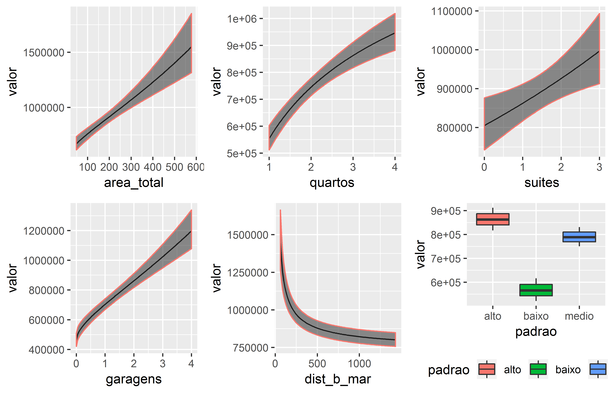

## Data

`appraiseR` comes with built-in `SpatialPointsDataFrames` such as `centro_2015`, `centro_13_15`, `itacorubi_2015`, `trivelloni_2005` and other `dataframes` like `loteamento`, `renda`, `canasvieiras_97`, `trindade_ap`, `terrenos_praia`, `trindade` and `jungles`.

More information on the available datasets can be find using the `help` command in `R`:


```r
help(centro_2015)
```


**Prices of 50 Florianopolis' downtown apartaments**

**Description**

A SpatialPointsDataFrame containing a sample of 50 apartaments with prices and other attributes in Florianopolis' downtown

**Usage**

`centro_2015`

**Format**

A tibble with 53 rows (50 samples and 3 apartments to be appraised) and 7 variables:

* valor: price, in brazilian Reais
* area_total: Total Area, in squared meters
* quartos: Rooms
* suites: Ensuites
* garagens: Garages
* dist_b_mar: Distance to the beach
* padrao: Building Standard - baixo, medio, alto (i.e. low, normal, high)

**Source**

**HOCHHEIM, Norberto**. *Engenharia de avaliacoes imobiliarias: Modulo Basico*. Florianopolis: IBAPE/SC, 2015, p.21-22

## Objective

Real Estate Appraisals in Brazil are standardized in NBR 14.653-2. The standard recommended procedure is to build a multiple linear regression analysis. Transformation of the parameters to obtain a better fit is usual, although appraisers are not familiar with box-cox or other methods to find best transformations.

The main purpose of `appraiseR` is to help engineers to find transformations of the parameters in the model in order to obtain the best fit that satisfies the recomendations stablished in NBR 14.653-2.

## Outlier analysis

Outlier analysis by several criteria can be achieved trough the `outlier_analysis` function:


```r
outlier_analysis(x = trindade, criterion = "30_percent")
```

```
## removing values
```

```
##  [1] 427 458 510 511 528 545 564 574 574 590 601 602 602 609 620
```

```r
outlier_analysis(x = trindade, criterion = "2_sd")
```

```
## Step 1: removing values 427
```

```
## Step 2: removing values 458
```

```
##  [1] 510 511 528 545 564 574 574 590 601 602 602 609 620
```

```r
outlier_analysis(x = trindade, criterion = "chauvenet")
```

```
## Step 1: removing values 427
```

```
## Step 2: removing values 458
```

```
##  [1] 510 511 528 545 564 574 574 590 601 602 602 609 620
```
 

## Running bestfit

`appraiseR` package includes both functions to help the appraiser to find best fits through the transformation of the parameters in the model (bestfit()) and functions to help the appraiser to verifie that the found fit satisfies the criteria of the brazilian standard NBR 14.653-2.

The first thing to be done is try to find the best model with bestfit function, as follows:


```r
library(appraiseR)
data <- as.data.frame(centro_2015@data)
best_fit <- bestfit(valor~., data)
```

`bestfit` automatically fits a series of transformations in the parameteres and combine them in several models. These models are later ordered  by the adjusted R^2^ criteria. By default, `bestfit` uses three transformations functions, equivalent to the use of the box-cox method with $-0.5 \leq \lambda \leq +0.5$. This can be changed with the `transf` argument.

If printed, a bestfit object shows a table of the best 10 models found according to the criteria mentioned above:


```r
print(best_fit)
```

```
## Call:
## bestfit.formula(formula = valor ~ ., data = data)
## 
## Best 10 fits:
##     id valor area_total quartos   suites garagens dist_b_mar    adj_R2
## 443  1 rsqrt       sqrt   rsqrt identity     sqrt      rsqrt 0.9480455
## 395  2 rsqrt   identity   rsqrt identity     sqrt      rsqrt 0.9477222
## 955  3 rsqrt       sqrt   rsqrt     sqrt     sqrt      rsqrt 0.9474578
## 907  4 rsqrt   identity   rsqrt     sqrt     sqrt      rsqrt 0.9472744
## 439  5 rsqrt       sqrt     log identity     sqrt      rsqrt 0.9471142
## 951  6 rsqrt       sqrt     log     sqrt     sqrt      rsqrt 0.9468425
## 391  7 rsqrt   identity     log identity     sqrt      rsqrt 0.9466028
## 903  8 rsqrt   identity     log     sqrt     sqrt      rsqrt 0.9465023
## 411  9 rsqrt        log   rsqrt identity     sqrt      rsqrt 0.9460101
## 407 10 rsqrt        log     log identity     sqrt      rsqrt 0.9455580
## ...
```

The number of printed lines may be changed in the print method, if desired:


```r
print(best_fit, n = 20)
```

The summary method is also available for bestfit objects. The user may find helpful not to use the first model in the table, so in the summary method is possible to choose the desired fit to be used with the fit argument, as follows:


```r
s <- summary(best_fit, fit = 1)
s
```

```
## Call:
## bestfit.formula(formula = valor ~ ., data = data)
## 
## Best (Chosen) Transformations:
##     id valor area_total quartos   suites garagens dist_b_mar    adj_R2
## 443  1 rsqrt       sqrt   rsqrt identity     sqrt      rsqrt 0.9480455
## 
## Best (Chosen) fit LM summary:
## 
## Call:
## lm(formula = "rsqrt(valor) ~ sqrt(area_total) + rsqrt(quartos) + identity(suites) + sqrt(garagens) + rsqrt(dist_b_mar) + (padrao)", 
##     data = data, subset = NULL)
## 
## Residuals:
##        Min         1Q     Median         3Q        Max 
## -2.144e-04 -5.344e-05  8.870e-07  4.272e-05  1.729e-04 
## 
## Coefficients:
##                     Estimate Std. Error t value Pr(>|t|)    
## (Intercept)        1.780e-03  1.301e-04  13.681  < 2e-16 ***
## sqrt(area_total)  -2.279e-05  5.295e-06  -4.304 9.81e-05 ***
## rsqrt(quartos)     6.561e-04  1.269e-04   5.169 6.14e-06 ***
## identity(suites)  -4.240e-05  2.060e-05  -2.058   0.0459 *  
## sqrt(garagens)    -2.711e-04  4.426e-05  -6.125 2.62e-07 ***
## rsqrt(dist_b_mar) -2.628e-03  5.099e-04  -5.154 6.45e-06 ***
## padraomedio       -2.214e-04  4.586e-05  -4.828 1.85e-05 ***
## padraoalto        -2.576e-04  4.605e-05  -5.595 1.52e-06 ***
## ---
## Signif. codes:  0 '***' 0.001 '**' 0.01 '*' 0.05 '.' 0.1 ' ' 1
## 
## Residual standard error: 8.428e-05 on 42 degrees of freedom
##   (3 observations deleted due to missingness)
## Multiple R-squared:  0.9555,	Adjusted R-squared:  0.948 
## F-statistic: 128.7 on 7 and 42 DF,  p-value: < 2.2e-16
## 
## NBR-14.653-2 check:
## Minimum number of market data:
## [1] "n = 53 >= 42 --> Grau III"
## Max significance level allowed for each predictor:
## [1] "t máximo = 4.59 %  < 10% --> Grau III"
## Max significance level allowed for F-test:
## [1] "p-valor F = 2.79e-24 % < 1% --> Grau III"
```

One can note that the summary method performs a linear model with the chosen fit to give the user the possibility to verifie the main diagnostics data of the model.

## Updating

You can easily update your calls to `bestfit`. For this, a update method is made available specific for bestfit objects.

Despite the effort made to find the best transformations there is a possibility that some outliers still be present in the model.
The user may search for them with very usual R functions, as `outlierTest` available in the `car` package:


```r
car::outlierTest(s$fit)
```

```
## No Studentized residuals with Bonferonni p < 0.05
## Largest |rstudent|:
##     rstudent unadjusted p-value Bonferonni p
## 31 -2.896612          0.0060262      0.30131
```

With the results of the outlier test, one can update the `bestfit` call as follows:


```r
best_fit <- update(best_fit, subset = -31)
summary(best_fit)
```

```
## Call:
## bestfit.formula(formula = valor ~ ., data = data, subset = -31)
## 
## Best (Chosen) Transformations:
##     id valor area_total quartos   suites garagens dist_b_mar    adj_R2
## 443  1 rsqrt       sqrt   rsqrt identity     sqrt      rsqrt 0.9566219
## 
## Best (Chosen) fit LM summary:
## 
## Call:
## lm(formula = "rsqrt(valor) ~ sqrt(area_total) + rsqrt(quartos) + identity(suites) + sqrt(garagens) + rsqrt(dist_b_mar) + (padrao)", 
##     data = data, subset = -31)
## 
## Residuals:
##        Min         1Q     Median         3Q        Max 
## -1.335e-04 -6.071e-05 -3.318e-06  4.302e-05  1.744e-04 
## 
## Coefficients:
##                     Estimate Std. Error t value Pr(>|t|)    
## (Intercept)        1.825e-03  1.210e-04  15.085  < 2e-16 ***
## sqrt(area_total)  -2.441e-05  4.915e-06  -4.966 1.25e-05 ***
## rsqrt(quartos)     6.301e-04  1.174e-04   5.368 3.41e-06 ***
## identity(suites)  -3.761e-05  1.907e-05  -1.972   0.0553 .  
## sqrt(garagens)    -2.787e-04  4.090e-05  -6.814 3.02e-08 ***
## rsqrt(dist_b_mar) -2.774e-03  4.729e-04  -5.865 6.72e-07 ***
## padraomedio       -2.038e-04  4.273e-05  -4.770 2.34e-05 ***
## padraoalto        -2.529e-04  4.250e-05  -5.951 5.09e-07 ***
## ---
## Signif. codes:  0 '***' 0.001 '**' 0.01 '*' 0.05 '.' 0.1 ' ' 1
## 
## Residual standard error: 7.772e-05 on 41 degrees of freedom
##   (3 observations deleted due to missingness)
## Multiple R-squared:  0.9629,	Adjusted R-squared:  0.9566 
## F-statistic: 152.2 on 7 and 41 DF,  p-value: < 2.2e-16
## 
## NBR-14.653-2 check:
## Minimum number of market data:
## [1] "n = 53 >= 42 --> Grau III"
## Max significance level allowed for each predictor:
## [1] "t máximo = 5.53 %  < 10% --> Grau III"
## Max significance level allowed for F-test:
## [1] "p-valor F = 2.94e-25 % < 1% --> Grau III"
```

One can note that without the outlier, the model now perfectly satisfies the main requirements of NBR 14.653-2.

## Plots

There are two plot functions in `appraiseR`: `plotdf` and `plotmod`. Before any fitting model activity, `plotdf` may be used to investigate outliers with the boxplot of the parameters of the model.


```r
plotdf(valor~., data)
```

<div class="figure" style="text-align: center">

<p class="caption">plotdf output.</p>
</div>

Then, once the models are fitted, `plotmod` plots regressors against the response variable, with confidence or prediction intervals:


```r
pl <- plotmod(best_fit, interval = "confidence", level = 0.80)
pl
```

<div class="figure" style="text-align: center">

<p class="caption">plotmod output.</p>
</div>

With these plots one verifies if the variables in the model works as predicted by the user.

By default, `plotmod` chooses the median values of the predictors other than the one plotted. The `local` argument in `plotmod` function allows the user to specify the variables plots against the regressor which passes through that local point.


```r
plotmod(best_fit, interval = "confidence", level = 0.80, 
        local = list(area_total = 205, quartos = 3, suites = 1, garagens = 2, 
                     dist_b_mar = 250, padrao = "medio"))
```

<div class="figure" style="text-align: center">

<p class="caption">plotmod output with local argument specified</p>
</div>

## Predictions

`predict` method is also available for `bestfit` objects. `predict` automatically searchs for newdata in the data frame of the model. `predict` does this searching for `NA` values in the response variable. If there are such data, then `predict` will automatically uses this values as the newdata option. Else, newdata must be explicitly provided to `predict.bestfit`, the same way it is done with `predict.lm`.


```r
p <- predict(best_fit, interval = "confidence", level = 0.80)
p
```

```
## Predictions:
##          fit       lwr      upr   AMP G.P.   C.A.I.    C.A.S.     L.I.
## 51  658637.5  721787.1 603426.9 17.97  III 559841.9  757433.2 603426.9
## 52  945582.0  997993.7 897193.2 10.66  III 803744.7 1087419.3 897193.2
## 53 1042721.7 1107561.0 983413.8 11.91  III 886313.4 1199129.9 983413.8
##         L.S.
## 51  721787.1
## 52  997993.7
## 53 1107561.0
```

